---
title: "App modernization with VMC"
tags: [K8s,VMC,cluster-api,capv]
featured_image: '../App-Modernization-with-VMC/images/new-application.png'
date: 2020-01-30
description: "A application modernisation example leveraging VMware Cloud and K8s"
---

In this blogpost we´re going to perform an exemplary application modernization. I wanted to provide an easy and understandable example how an existing application can be modernized in order to take advantages of modern application architecture by leveraging Kubernetes.

Modernising parts of an existing application is what I observed in real world customer scenarios. Parts of an application are modernized to take the maximum value compared to the high effort of refactoring the whole application. There are a variety of reasons why a modernization makes sense. Common examples would be to enable the use of features like auto-scaling and monitoring or the decomposition of single modules because they became too big and complex for a single team to fully understand and maintain.

I recommend to read the blogpost first and then watch the video.



### Base Case
Our company in this showcase is called "Commute Analytics" and is providing a service to identify which is the best time in order to start your journey when commuting.  
The company chose to move all their workloads to the cloud since their contracts for the Datacenter are expiring and they chose not to invest in a new datacenter location.
 
 

### Workload Migration
The first thing our Company needs to achieve is the evacuation of their current Datacenter. After a successful pilot Commute Analytics chose to leverage VMware Cloud on AWS with VMware HCX to migrate all their workloads to the cloud. Our example starts after the workloads have been migrated from on premises to VMware Cloud on AWS with HCX. If you don´t know what HCX is i highly recommend [to read this article.](https://blogs.vmware.com/vsphere/2019/10/cloud-migration-series-part-1.html)
 
 

### How does the current application look-like?
Our application is accessible for users at "http://commuteanalytics.corp.local". Every user can enter the source and destination address of their journey and will get recommendations when it´s best to start driving.

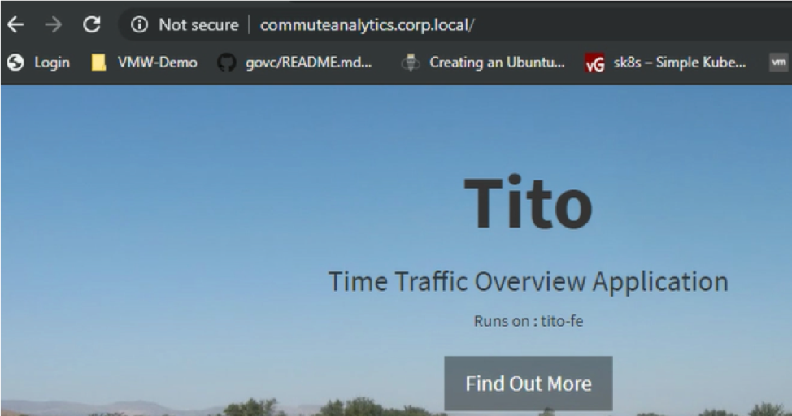
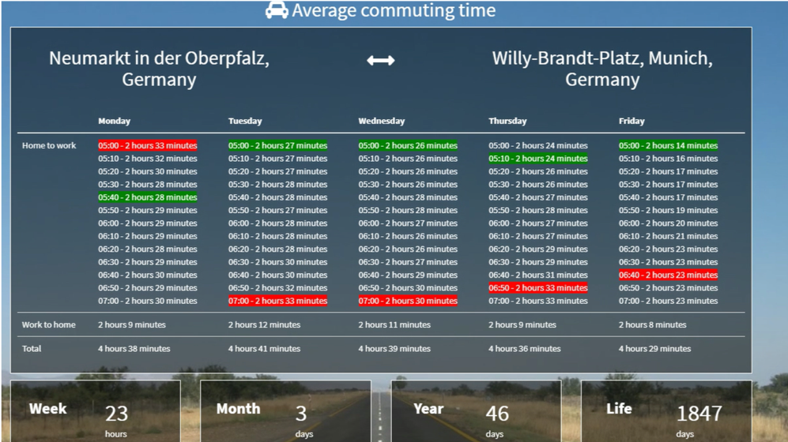

 
 

### Tackling the application problems
After the successful migration to VMware Cloud on AWS the company is still facing problems with their application and users are complaining about performance during peak times.
 

The current application architecture looks like the following:

 
 

**A analysis of the application has shown that:**

- The current application architecture limits throughput and does not scale to the amount of users
- Upgrades are difficult to achieve and always require a downtime
- The bottleneck of the application is the frontend which is not capable of handling the amount of users during peak times

Since our bottleneck is the frontend of the application we´re going to modernize this part of the application while leaving the Databse as a VM.

 

## Prerequisites: Running Kubernetes on VMware Cloud on AWS
We choose to modernize the frontend and migrate this part of the application to K8s. Therefore we are leveraging Tanzu Kubernetes Grid (former Essentials PKS) - VMware´s upstream Kubernetes distribution which helps to provide a common Kubernetes distribution across all your environments. I will write a seperate blogpost about how to deploy TKG on VMC leveraging Cluster-API and the options you´re having for Load Balancing and Ingress controllers in the near future. 

The picture below shows TKG on VMConAWS with one workload-cluster roled out as well as the current application VMs "tito-db" and "tito-fe".
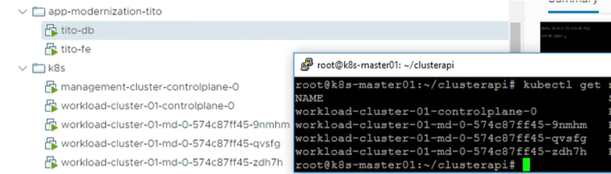
 
 

## Prepare the Frontend
In order to enable a smooth migration we´re leveraging the existing Apache configuration of the frontend VM "tito-fe" and creating a container which will act as our new frontend.

The next thing is to build our container image for the new frontend. 
Let´s have a look at our Dockerfile - you see that we´re copying the apache config in line 5 to the container image.
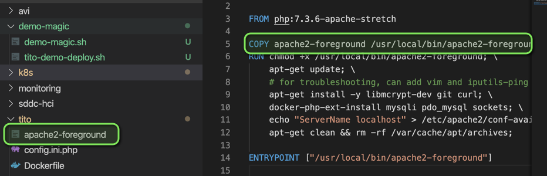

As a next step we build our container image and upload it to the registry of choice. For this Demo I chose to simply use Docker hub. If you wanna try this at home you will find prebuild containers [on my docker Docker registry ](https://hub.docker.com/repository/docker/adess/vmc-demo-k8s)
 
 

## Additional Components
In order to make our application scalable we need some additional components. Most important we´re switching from the single VM to a load balanced approach leveraging K8s. To create the Load Balancer in K8s we will apply the following file to our K8s Cluster. The actual Load Balancer is then automatically implemented by the AVI networks solution which is deployed on the cluster. In terms of reliability we´re also setting a fixed IP for our Load Balancer in Line 27.
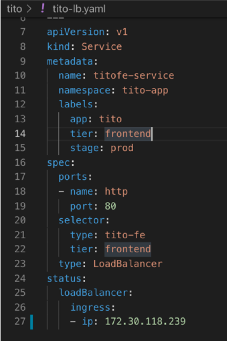

        kubectl apply -f tito-lb.yaml
 
 

## Application deployment
Right now our old 2-Tier application is still running and serving users. At the same time we´re going to deploy our new K8s based frontend which will use the existing database in the backend. This procedure is completly transparent for the users which are using the service since they are still served by the old frontend VM.

Let´s deploy our K8s based frontend and point it to the IP of our existing MySQL VM:
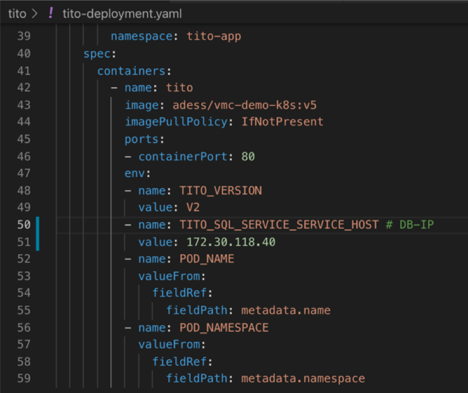

        kubectl apply -f tito-deployment.yaml
 
 

## Migrate the Users   
Right now our application is accessible by the old DNS entry for our users but also via the new Load Balancer IP. This is possible because the frontend is completly stateless. A huge benefit is that we access the application via the IP and are able to verify and test the funcionality of the application.

Access via K8s LB-IP:
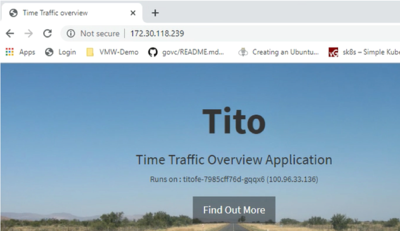
 

After we confirmed the correct functionality of our application we can simply migrate our users by changing our DNS record from the VM to our new K8s LB IP and our clients will be moved uninterrupted to the new K8s based frontend.
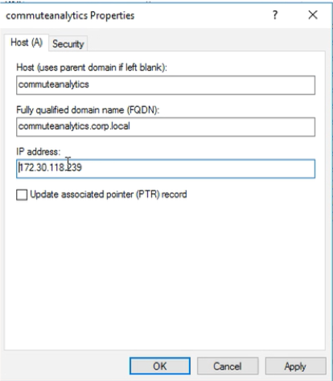

## Leverage the new Application architecture
Our modernized application does now look like the following:
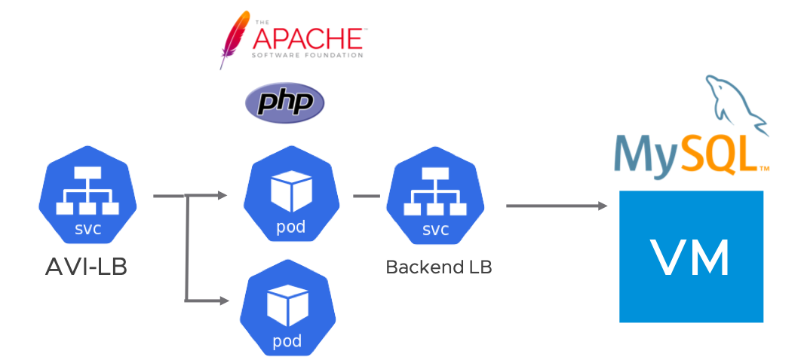
Let´s remember why we wanted to modernize the application in the first place. There have been scalability problems and users complained about bad performance during peak times.
To tackle this we can now use K8s build in functionality like the horizontal pod autoscaler or simply scale our deployment up manually because we´re expecting higher load during peak times. 

As we can see below the deployment was scaled up from the inital two to 10 replicas (containers) and we can immediately see the CPU load dropping in Grafana.
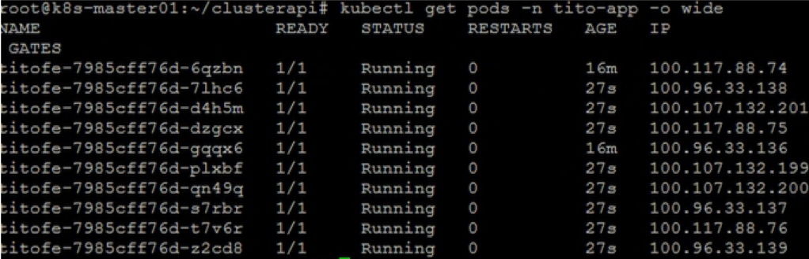
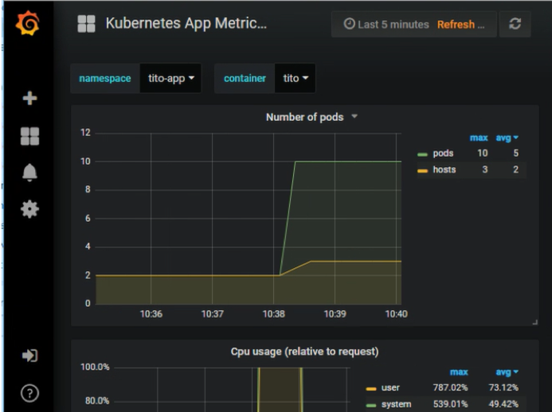

I hope you enjoyed reading this blogpost. Stay tuned - in the next blogposts i would like to show you how you can improve visibility for your K8s applications via Prometheus and Grafana and how to attach your existing clusters to Tanzu Mission Control. 

 
 
## Important Links:
Github:  
https://github.com/appdess/Tito  
Docker-Hub:  
https://hub.docker.com/repository/docker/adess/vmc-demo-k8s/ 
VMware-Cloud:  
https://cloud.vmware.com/  
HCX:  
https://cloud.vmware.com/de/vmware-hcx 

#VMwarePKSonVMC
#TKG
#VMware