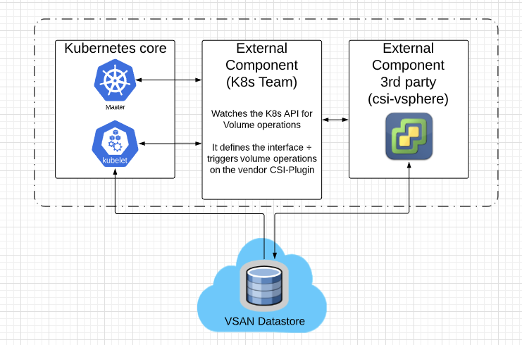
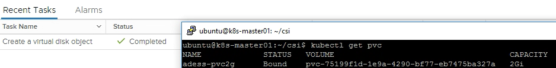

---
title: "K8s ClusterAPI"
tags: [K8s,VMC,Storage]
featured_image: '../Cluster-API/images/csi-drawing.png'
date: 2019-10-31
description: "State of the art povisioning for K8s Clusters"
---

### What is the CAPI Project about?

ClusterAPI is a project focussing on the lifecycle management day0 to day2 in order to ease the management for K8s Clusters. The project explains itself with:

> The Cluster API is a Kubernetes project to bring declarative, Kubernetes-style APIs to cluster creation, configuration, and management.

### Get the environment ready
In order to leverage all the functionality please make sure you´re using the latest version.

- vSphere > 6.7 U3 (Cloud Native-Storage was introduced in this Version)
- govc installed and configured - please see [This Post](https://alexdess.cloud/posts/govc/)
- kind (kubernetes in docker)

### CSI Components:
The drawing below is a logical drawing regarding the neccessary components and high-level interaction between those.

In this tutorial we will leverage the csi-vsphere which enables the provisioning of those static values on demand. For the current K8s version the CSI-Plugin is the preferred way to be leveraged.

# Check your versions and tooling

- vSphere > 6.5
- K8s > 1.14 (I´m using 1.15.2)
- govc installed and configured - please see [This Post](https://alexdess.cloud/posts/govc/)

## First step is to get the vsphere-csi-driver

We´re going to clone the vSphere CSI-Driver plugin to your nodes. You can clone this to all of them or distribute via scp

    git clone https://github.com/kubernetes-sigs/vsphere-csi-driver.git

## Enable Disk UUID for all your Nodes

If you followed my previous post you have most likely already enabled this setting. If you haven´t please enable the disk.enableUUID=1

    govc vm.change -vm k8s-master01 -e "disk.enableUUID=1"
    govc vm.change -vm k8s-worker01 -e "disk.enableUUID=1"
    govc vm.change -vm k8s-worker02 -e "disk.enableUUID=1"

## Providing the vSphere Credentials to the CSI-Plugin

There are two options how to provide the csi-vsphere our vCenter Credentials.

- Using a K8s Secret
- Within the vSphere.conf

In our case we will provide the secrets in the vsphere.conf since we´re working in our lab-environment. For a real environment we would for sure store the credentials in a K8s secret.

My vsphere.conf:

    [Global]
    user = "cloudadmin@vmc.local"
    password = "Highlysecure-XXXX-"
    port = "443"
    insecure-flag = "1"
    
    [VirtualCenter "10.56.224.4"]
    datacenters = "SDDC-Datacenter"
    
    [Workspace]
    server = "10.56.224.4"
    datacenter = "SDDC-Datacenter"
    default-datastore = "WorkloadDatastore"
    resourcepool-path = "SDDC-Datacenter/host/Cluster-1/Resources/Compute-ResourcePool"
    folder = "adess"

Create configmap:

### Create the RBAC roles

Next we need to create the neccessary rbac roles

    ubuntu@k8s-master01:~/vsphere-csi-driver$ kubectl create -f manifests/1.14/rbac
    
    serviceaccount/vsphere-csi-attacher created
    clusterrole.rbac.authorization.k8s.io/external-attacher-runner created
    clusterrolebinding.rbac.authorization.k8s.io/csi-attacher-role created
    serviceaccount/vsphere-csi-provisioner created
    clusterrole.rbac.authorization.k8s.io/external-provisioner-runner created
    clusterrolebinding.rbac.authorization.k8s.io/csi-provisioner-role created
    serviceaccount/vsphere-csi-controller created
    clusterrole.rbac.authorization.k8s.io/vsphere-csi-controller-role created
    clusterrolebinding.rbac.authorization.k8s.io/vsphere-csi-controller-binding created
    

### Wohoo! We´re now ready to deploy our csi-vsphere

Deploy from the git-repo. It´s mandatory to have the cluster setup with kubeadm in order to properly work:

    kubectl create -f manifests/1.14/deploy
    statefulset.apps/vsphere-csi-attacher created
    statefulset.apps/vsphere-csi-controller created
    [csidriver.storage.k8s.io/vsphere.csi.vmware.com](http://csidriver.storage.k8s.io/vsphere.csi.vmware.com) created
    daemonset.apps/vsphere-csi-node created
    statefulset.apps/vsphere-csi-provisioner created

### Next we need to create a Storage Class

Adjust the values according to your deployment. For the deployment on VMC it is absolutely mandatory that we´re selecting the Workload-Datastore

    ubuntu@k8s-master01:~/csi$ cat sc.yaml
    kind: StorageClass
    apiVersion: storage.k8s.io/v1
    metadata:
            name: vsan
            namespace: kube-system
            annotations:
                    storageclass.kubernetes.io/is-default-class: "true"
    provisioner: vsphere.csi.vmware.com
    parameters:
            parent_type: "Datastore"
            parent_name: "DatastoreWorkloadDatastore"
    
    # Apply to create our Storage-Class:
    kubectl apply -f sc.yaml

After creating a storage-class into the K8s-API we can now create a persistent Volume Claim

    cat pvc.yaml:
    
    apiVersion: v1
    kind: PersistentVolumeClaim
    metadata:
      name: adess-pvc
    spec:
      accessModes:
      - ReadWriteOnce
      resources:
        requests:
          storage: 5Gi
      storageClassName: vsan

Lets check if our volume was created accordingly. If you get the status "Bound" it has been successfully created. At the same time you should see a vmdk created in vCenter.

    ubuntu@k8s-master01:~/csi$ kubectl get pvc
    NAME             STATUS   VOLUME                                     CAPACITY   ACCESS MODES   STORAGECLASS   AGE
    adess-pvc2g      Bound    pvc-75199f1d-1e9a-4290-bf77-eb7475ba327a   2Gi        RWO            vsan           5s

That´s it - stay tuned. In the next post we will leverage this to deploy a stateful Kubernetes application!