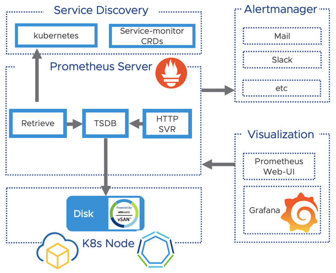
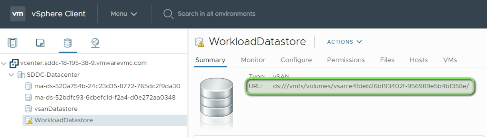
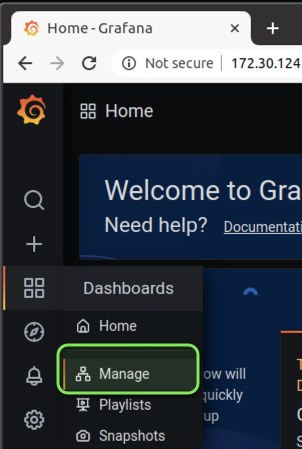
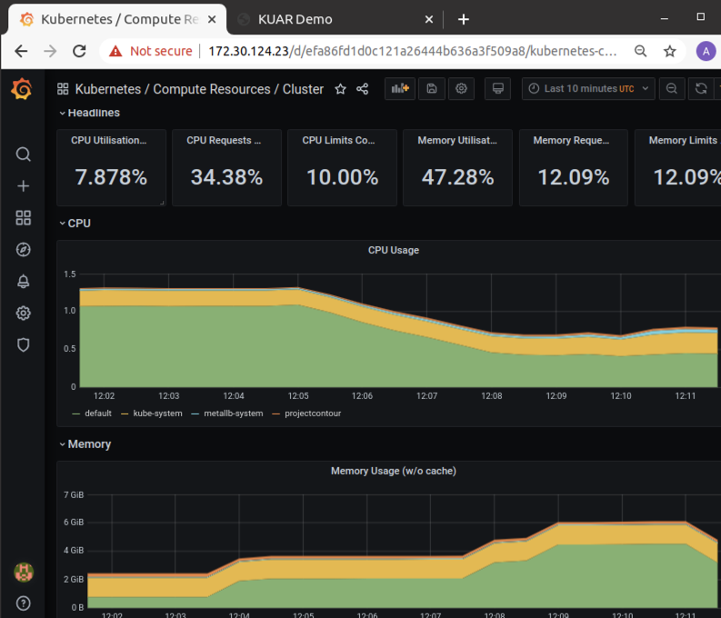
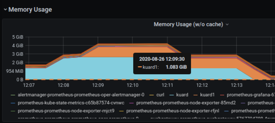
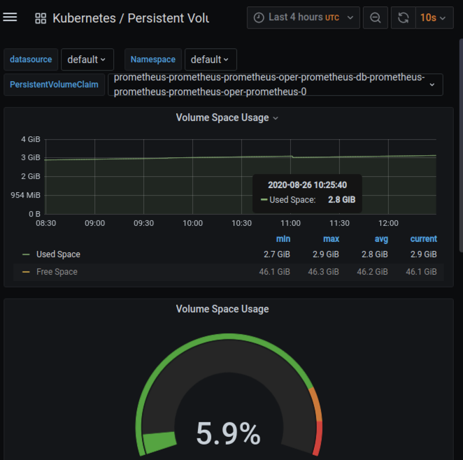

## Leveraging the Prometheus Operator on VMC

Prometheus was the second project which joined the Cloud Native Computing foundation after Kubernetes in 2016. Originally it was founded 2012 at Soundcloud but is now completely vendor independent and open source. A lot companies have already adopted Prometheus, and the project has a highly active community.  Customers which are running VMware Tanzu Kubernetes Grid+ are provided with full Enterprise support included with their [TKG+ subscription.](https://kb.vmware.com/s/article/78173) 

While Prometheus is free it doesn't´t mean that it´s easy and straightforward to understand and to deploy. This is why I made this blogpost to get your Prometheus instance on VMware-Cloud and any  K8s environment up and running in - let´s say less than 4 Minutes ;). 

To start with this tutorial you will need:

- [Helm installed on your machine](https://helm.sh/)
- [TKG+ or another K8s Cluster using the CSI Storage driver on vSphere or VMware-Cloud](https://alexdess.cloud/posts/tkgonvmc/)
- A cup of coffee and 4-6 Minutes time 🙂
<br>
<br>

### Prometheus Architecture

In this blogpost we will deploy prometheus and visualise our K8s cluster metrics like the CPU utilisation or the utilisation of our Persistent Volumes with Grafana. 

Let´s have a quick look at the prometheus architecture below. I simplified the diagram to the components which we will focus on later in the tutorial:

- The Prometheus Server which stores our time-series data
- Grafana to visualise your collected metrics
- The Altermanager component to get you out of bed if necessary ;)

**The picture below shows the Architecture of Prometheus:**

<br>
<br>

### Deploy the Operator

We are going to leverage the [Prometheus operator](https://github.com/prometheus-operator/prometheus-operator) deployed via a helm chart. It  packages up all the components of Prometheus which are necessary for our logging stack. 

If you don´t know what Helm is I recommend you to check out [this Link](https://helm.sh/). If you want to learn more about the Operator-Pattern in K8s i recommend to check out [this](https://kubernetes.io/docs/concepts/extend-kubernetes/operator/) link.
<br>
<br>

### Cloud Native Storage for our metrics

We want to persist our metrics and will make use of the Cloud-Native Storage Integration of vSphere. Notice that you need at least vCenter version 6.7U3 which provides the required API.

First we want to make sure that we have a Storage Class created accordingly in K8s pointing to a Datastore in vSphere.

If you have a usable default Storage Class already you can skip this step. You may want to check if you have a Storage-Class already available by running:

```bash
$ kubectl get sc
NAME                PROVISIONER                 
default (default)   csi.vsphere.vmware.com
```

If you have a working default Storage class for your environment you can skip the creation. Otherwise you can create the storage class accordingly or use the "sc.yaml" file from my repo and adjust it to fit to your environment.

```yaml
# Download the Storage Class example file:
$ wget https://raw.githubusercontent.com/appdess/prometheus-operator-vsphere/master/sc.yaml
```

Make sure you replace the value for "**datastoreurl**" according to your environment. <br>
You can get this value from the vSphere or VMC-UI in the "Storage" Tab.



```yaml
# adjust the "datastoreurl" according to your environment BEFORE you apply the storage-class!
kind: StorageClass
apiVersion: [storage.k8s.io/v1](http://storage.k8s.io/v1)
metadata:
name: default # this is the storage class name we will create in K8s
namespace: default
labels:
annotations:
[storageclass.kubernetes.io/is-default-class:](http://storageclass.kubernetes.io/is-default-class:) "true"
provisioner: [csi.vsphere.vmware.com](http://csi.vsphere.vmware.com/)
allowVolumeExpansion: true
parameters:
storagePolicyName: "vSAN Default Storage Policy" # our vSAN Storage policy from vCenter
**datastoreurl**: **"ds:///vmfs/volumes/vsan:e4fdeb26bf93402f-956989e5b4bf358e/**" # the Datasture-URL of our WorkloadDatastore


# Apply the Storage Class in your Environment**
$ kubectl apply -f sc.yaml

# this should output
$ storageclass.storage.k8s.io/default created
```

Ok  - we´ve successfully created a Storage Class which points to our vSAN Datastore and leverages the "vSAN Default Storage Policy" - we´re good to deploy Prometheus.

### Deploy the Prometheus Operator

We need to adjust the default deployment to fit to our environment. The great thing leveraging helm is that we can specify a central file called "values.yaml" which will override the given standard values. This is how you customise deployments with helm to fit to your infrastructure and requirements.

You can customise the deployment leveraging a yaml file. My file below is called "values.yaml" and specifies the standard PW for Grafana, the vSphere Storage Class we created before and a setting for the serviceMonitor discovery of Prometheus.

If you are using the Storage Class "default" in your environment you can simply use my updated file and start the deployment via Helm.

Below is my customisation i applied to the [original file](https://raw.githubusercontent.com/helm/charts/master/stable/prometheus-operator/values.yaml) - you can customise further or **skip this step and continue with the helm deployment by leveraging my template file below.**

```yaml
# OPTIONAL BOX - you may want to use my prepared file below instead of customisig your own

# get the latest values.yaml file and edit it accordingly or take my example:
wget https://raw.githubusercontent.com/helm/charts/master/stable/prometheus-operator/values.yaml

# change the admin PW for Grafana
adminPassword: VMware1!

# Change the Storage Spec to use our "default" Storage Class 
storageSpec: 
      volumeClaimTemplate:
        spec:
          storageClassName: default
          accessModes: ["ReadWriteOnce"]
          resources:
            requests:
              storage: 50Gi

# set the value for service-discovery to discover sevice-montors (crds) created in the namespace
serviceMonitorSelectorNilUsesHelmValues: false
```

**Deploy the Prometheus operator to our K8s Cluster**

```yaml
# get the values exmaple file which contains the changes from above:
$ wget https://raw.githubusercontent.com/appdess/prometheus-operator-vsphere/master/values.yaml

# install the Prometheus operator via helm customized by our file:
$ helm install prometheus stable/prometheus-operator -f values.yaml

# this should output the following:
The Prometheus Operator has been installed. Check its status by running:
```

**Verify the status of the components:** 

```bash
$ kubectl --namespace default get pods -l "release=prometheus"
NAME                                                   READY   STATUS    RESTARTS   AGE
prometheus-prometheus-node-exporter-dhcfm              1/1     Running   0          93s
prometheus-prometheus-node-exporter-gcn6q              1/1     Running   0          93s
prometheus-prometheus-node-exporter-p2gs4              1/1     Running   0          93s
prometheus-prometheus-node-exporter-x7ff9              1/1     Running   0          93s
prometheus-prometheus-oper-operator-769d757547-vh9kc   2/2     Running   0          93s
```
<br>
<br>

### Configure Access to Grafana

Let´s also check the services which have been created by our deployment. We are especially interested in the Grafana service since we want to access the Dashboard to view our collected metrics.

```bash
$ kubectl get svc
NAME                                      TYPE        CLUSTER-IP       EXTERNAL-IP   PORT(S)                      AGE
prometheus-grafana                        ClusterIP   100.64.44.227    <none>        80/TCP                       14m
prometheus-kube-state-metrics             ClusterIP   100.69.121.82    <none>        8080/TCP                     14m
prometheus-operated                       ClusterIP   None             <none>        9090/TCP                     14m
```

You can either change the internal Cluster-IP of "prometheus-grafana" to an external loadbalancer IP or simply make the user interface available leveraging a kubectl port-forwarding to your local machine.

**How to setup port forwarding to your local machine:**

```yaml
$ kubectl port-forward deployment/prometheus-grafana 8080:3000

Forwarding from 127.0.0.1:8080 -> 3000
Forwarding from [::1]:8080 -> 3000
```

You can now access Grafana by opening a browser to http://127.0.0.1:8080

**How to configure a load balancer for Grafana:**

```yaml
$ kubectl patch svc prometheus-grafana -p '{"spec": {"type": "LoadBalancer"}}'

# check your IP to access Grafana:
$ kubectl get svc prometheus-grafana
NAME                 TYPE           CLUSTER-IP       EXTERNAL-IP     PORT(S)        
prometheus-grafana   LoadBalancer   100.66.133.185   **172.30.124.23**   80:31365/TCP
```

You can now access Grafana by opening a browser and point it to http://**172.30.124.23 (Your external IP from above)** 

Depending which method you choose you access the dashboard either via:

- Port-Forwarding:  http://127.0.0.1:8080
- LoadBalancer:      [http://**172.30.124.23](http://172.30.124.23)** (The IP for your service from above)
- User: admin | PW: VMware1!


Next we want to add our first dashboard to view our Cluster Resources. You can do this by navigating to "Dashboard" and "Manage".




Now you can select an example Dashboard. I´ve chosen to select the "Cluster Dashboard" to get an holistic view about all my K8s Cluster Resources.

You will notice there are a lot default templates already available which you can customise due to your needs. You can also drill down on the resources to investigate for example what namespaces and pods are consuming the most memory.



While the above graph shows the memory consumption per namespace, the graph below shows the memory consumption per POD in a given namespace. 


<br>
<br>

## Verify Persistent Storage for Prometheus

Containers are stateless per default but our data should not be lost when the containers for our deployment are updated or restarted.  Let´s do a quick check if our Persistent Volume was successfully created and the data is written to it accordingly.

We are able to do this and view the Persistent Volumes as well as their current storage consumption in the Grafana UI. The dashboard is in the templates folder and simply called "Persistent Volumes":

**Viewing our Persistent Volume Claim including the usage created with our Storage Class:**



<br>
**Access to all service components with ingress** <br>
Grafana, Alertmanager and Prometheus area already three services you might want to access via a port forwarding or a Loadbalancer to access them. While I´ve showed you above how to do this in a easy matter there might be a better way to configure this. If you already deployed an ingress controller like contour on your cluster, you can simply create a ingress below to enable access to those services. I will explain in a later post how to use and configure ingress on a TKG+ Cluster accordingly.

My "prometheus-ingress.yaml" below:

    apiVersion: networking.k8s.io/v1beta1
    kind: Ingress
    metadata:
      name: prometheus
      namespace: default
    spec:
      rules:
      - host: alertmanager.set.local
        http:
          paths:
          - backend:
              serviceName: prometheus-prometheus-oper-alertmanager
              servicePort: 9093
      - host: grafana.set.local
        http:
          paths:
          - backend:
              serviceName: prometheus-grafana
              servicePort: 80
      - host: prometheus.set.local
        http:
          paths:
          - backend:
              serviceName: prometheus-prometheus-oper-prometheus
              servicePort: 9090

That´s it for the first post - we successfully setup Prometheus with Persistent Storage and Grafana to visualise our data. Thank you for reading and stay tuned for the next topics like alerting, setting up ingress and how to get your application metrics into Prometheus.