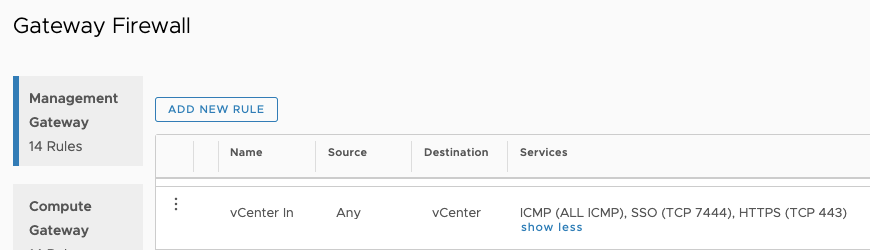
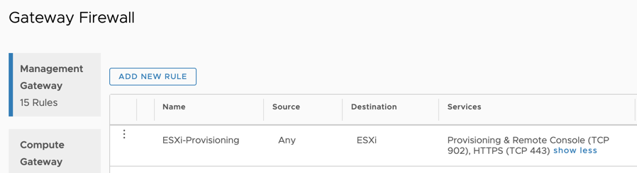

## Automate your VM Deployments

In this Blogpost you will learn to leverage one of my favourite automation tools called "GoVC" to automate your virtual machine and OVF-Deployments for VMware Cloud on AWS and vSphere. The tool does a great job making in creating repeatable deployments of VMs and OVFs.

If you are working with lab environments it´s key to have a repeatable and reliable way to deploy your VMs without having to enter a lot data over and over again. I guess there´s not a single admin out there who hasn´t klicked thourgh a OVA-Deployment wizard multiple times because some minor setting was wrong causing the deployment to fail ;).  From this day on you will want to use GoVC and never face this problem again.

In my example below, we´re using GoVC to preapre a ubuntu-Image for vSphere and clone it a few times. My machine I am operating from is a ubuntu running inside my VMware Cloud on AWS SDDC. You can use any OS as long as you have connectivity to your vCenter.
  

### First things first - Install GoVC
Let´s start by downloading GoVC for our operating system. The easiest way is to go to the github page and pick the appropirate download for your OS.

Go to Github and determine the Version neccessary for your OS.
https://github.com/vmware/govmomi/releases

Download the Version for your OS, make it executable and move it into your path:

        curl -L https://github.com/vmware/govmomi/releases/download/prerelease-v0.21.0-58-g8d28646/govc_linux_amd64.gz| gunzip > /usr/local/bin/govc
        # make govc executable
        chmod +x /usr/local/bin/govc
 

### Allow communication
In order to do deployments from our Jumphost where we just installed with GoVC, we need to setup some firewall rules.  GoVC will first talk to the vCenter but the actual deployment happens via a direct communication to the ESXi host so we have to open the firewall for these ports. In my example below I am showing how to achieve this in the VMC-Console of our SDDC.

* In the VMC console navigate to:
    + Network and Security 
    + Gateway Firewall 
    + Management Gateway 

and setup the following rules to allow the incomming traffic from our Jumphost:

To the vCenter Server:

To the ESXi-Hosts:

  
### Configure your vCenter Connection
A huge benefit of GoVC is that you can work with environment variables. This enables you to easily switch between multiple environments.  
We will create a configuration file which contains the connection details for your vCenter in order to leverage it for the deployment.

Create a text file with your favourite editor which contains the following data:

    cat vmc-govcvars.sh
    #!/bin/bash
    export GOVC_INSECURE=1 # In order to NOT verify SSL certs on vCenter
    export GOVC_URL=https://vcenter.sddc-XXXXXXXXX.vmwarevmc.com/sdk # Your SDDC / vCenter IP or FQDN
    export GOVC_USERNAME=cloudadmin@vmc.local # vCenter username
    export GOVC_PASSWORD=HIGHLYSECURE123 # vCenter password
    export GOVC_DATASTORE=WorkloadDatastore # Default datastore to deploy to - Neccessary for deployments to VMC!
    export GOVC_NETWORK=EMEA-VMC-TEST-04-DHCP # Default network to deploy to
    export GOVC_RESOURCE_POOL=/SDDC-Datacenter/host/Cluster-1/Resources/Compute-ResourcePool # Default resource pool to deploy t
    export GOVC_FOLDER=adess # Default folder for our deployments

 
Now we source the file created to make use of the variables

    source vmc-govcvars.sh

As a last thing we want to check if govc was successfully installed:
        
    vmware@adess-jh:~/deploy$ govc about
    Name:         VMware vCenter Server
    Vendor:       VMware, Inc.
    Version:      6.8.7
    Build:        13619665
    OS type:      linux-x64
    API type:     VirtualCenter
    API version:  6.7.2
    Product ID:   vpx
    UUID:         56d58607-fd5c-4206-84cb-acb4ed88276f

If this command shows you information about your vCenter you have successfully installed and configured GoVC.  
{...woohooo!!!}

  

### Create a template and start automating!
Now that we verified the successfull setup of GoVC, we can create our vSphere template.  
We will use a ubuntu server image which is slim, functional and can be leveraged to create a vSphere template. You can use any appliance or OVA-Template here :)!

The next steps will download our OVA Image to the Jumphost and prepare it for deployment:

    # download the ova image:
    wget https://cloud-images.ubuntu.com/releases/18.04/release/ubuntu-18.04-server-cloudimg-amd64.ova

    # Extract the ova-specs from the image to a "ubuntu1.json" file
    govc import.spec ubuntu-18.04-server-cloudimg-amd64.ova | jq . > ubuntu1.json

    Now we can edit the specification and specify a network or a SSH-Key. 
    Note that for ubuntu you HAVE to specify your public key in order to logon after deployment.

    vmware@adess-jh:~/deploy$ cat ubuntu.json
    {
    "DiskProvisioning": "thin",
    "IPAllocationPolicy": "dhcpPolicy",
    "IPProtocol": "IPv4",
    "PropertyMapping": [
        {
        "Key": "instance-id",
        "Value": "id-ovf"
        },
        {
        "Key": "hostname",
        "Value": "ubuntu1804"
        },
        {
        "Key": "seedfrom",
        "Value": ""
        },
        {
        "Key": "public-keys",
        "Value": "ssh-rsa AAAAB3NzaC1ycXXXX/ZXgTKs7LhVNc+Od5SPl98PkviU3lUsgkt5tavyyR5Qbxqs+r6zbZKfXXXXXD/Q4djNPEEnZJ6Qw4SJIQn/Ygpps6CsvGrccYAC7XXXXXXXXXXXblBs5qXBhr+It/73 vmware@adess-jh"
        },
        {
        "Key": "user-data",
        "Value": ""
        },
        {
        "Key": "password",
        "Value": "VMware1!"
        }
    ],
    "NetworkMapping": [
        {
        "Name": "VM Network",
        "Network": "EMEA-VMC-TEST-04-DHCP"
        }
    ],
    "MarkAsTemplate": false,
    "PowerOn": true,
    "InjectOvfEnv": false,
    "WaitForIP": false,
    "Name": "ubuntu1804-template"
    }
 

After we did the specification we can now we can deploy the machine to vSphere:
    
    govc import.ova -options=ubuntu.json ubuntu-18.04-server-cloudimg-amd64.ova

The cool thing is once you created a config-file for a OVA like we did above you can deploy n-number of machines from it without having to specify all parameters over and over again.

### Using GoVC for vSphere Cloning
As we seen above, govc is great to automate the deployment of OVA-Images but you can leverage it to basically automate any vShere Operation. Below i want to show you a few very helpful operations:
 

#### Clone multiple VMs from a Template
We will use govc to clone 4 VMs from our newly created template with our guest-customization "Ubuntu".

    govc vm.clone -vm ubuntu1804-template -customization=Ubuntu k8s-master01
    govc vm.clone -vm ubuntu1804-template -customization=Ubuntu k8s-worker01
    govc vm.clone -vm ubuntu1804-template -customization=Ubuntu k8s-worker02
    govc vm.clone -vm ubuntu1804-template -customization=Ubuntu k8s-worker03

#### Power VMs on and of:
    govc vm.power -on=true k8s-master01
 

#### Search a VM by IP
    govc find . -type m -guest.ipAddress "172.30.118.34" -runtime.powerState poweredOn
    /SDDC-Datacenter/vm/Workloads/adess/k8s-master01
 

#### Get detailed information about a VM:
    govc vm.info k8s-master01
    Name:           k8s-master01
    Path:         /SDDC-Datacenter/vm/Workloads/adess/k8s-master01
    UUID:         422597fd-d975-99d0-49af-6a3074d53415
    Guest name:   Ubuntu Linux (64-bit)
    Memory:       4096MB
    CPU:          4 vCPU(s)
    Power state:  poweredOn
    Boot time:    <nil>
    IP address:   172.30.118.34
    Host:         10.56.32.4
 

#### Upload a file to a Datastore:
The command below will upload our ubuntu-ova image to the Workloaddatastore in the directory /isos

    govc datastore.upload ubuntu-18.04-server-cloudimg-amd64.ova /isos/ubuntu.ova

 

#### Info for ResourcePool
    govc pool.info Compute-ResourcePool
    Name:              Compute-ResourcePool
    Path:             /SDDC-Datacenter/host/Cluster-1/Resources/Compute-ResourcePool
    CPU Usage:        12618MHz (5.6%)
    CPU Shares:       normal
    CPU Reservation:  0MHz (expandable=true)
    CPU Limit:        -1MHz
    Mem Usage:        368534MB (26.2%)
    Mem Shares:       normal
    Mem Reservation:  0MB (expandable=true)
    Mem Limit:        -1MB

I hope this post will help you to automate your daily tasks in your SDDC .

  
### Useful Links.
[https://github.com/vmware/govmomi](https://github.com/vmware/govmomi)