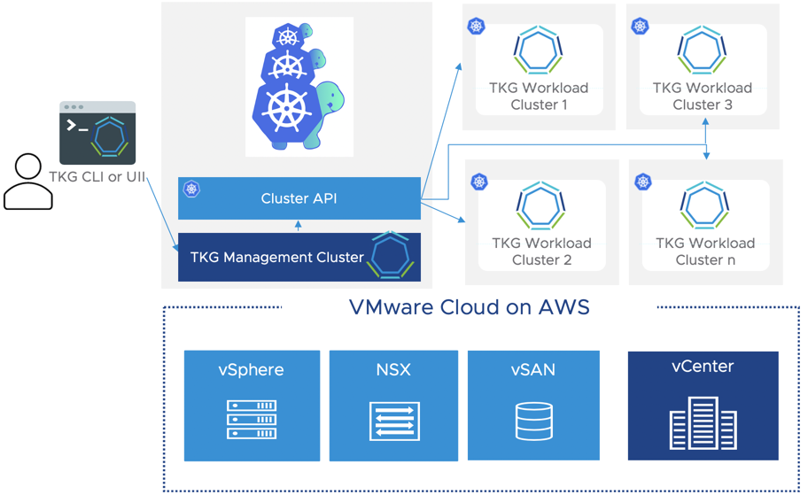
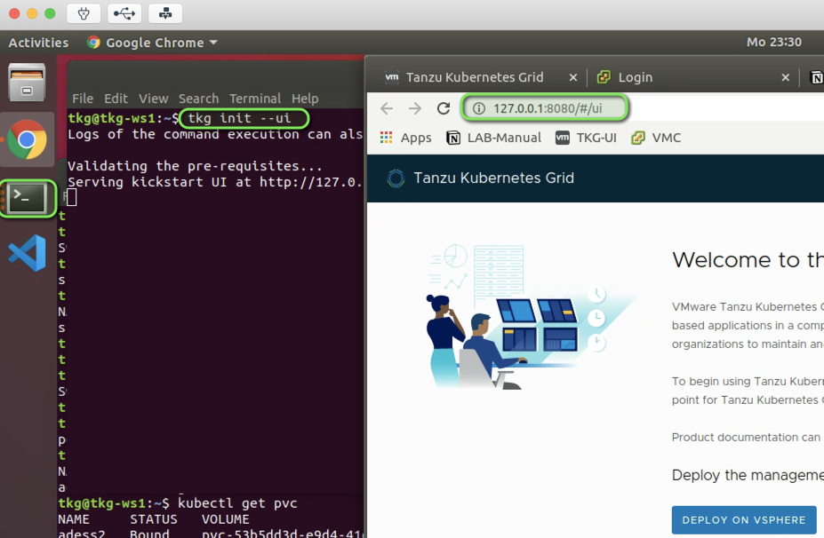
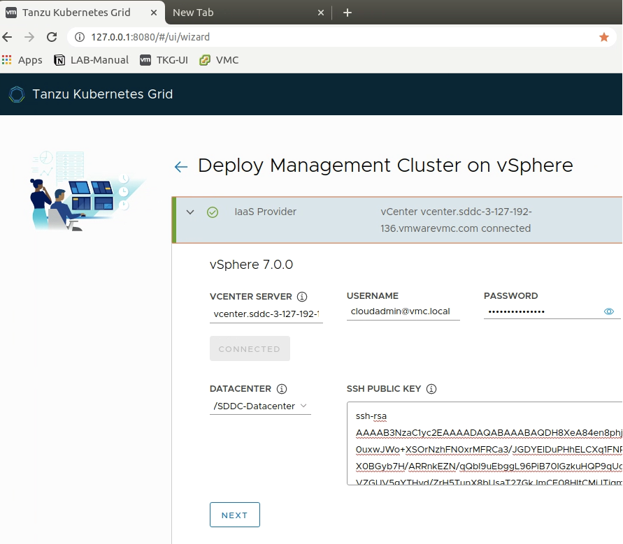
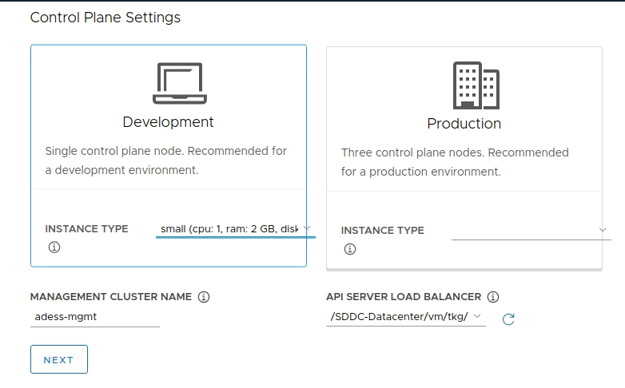
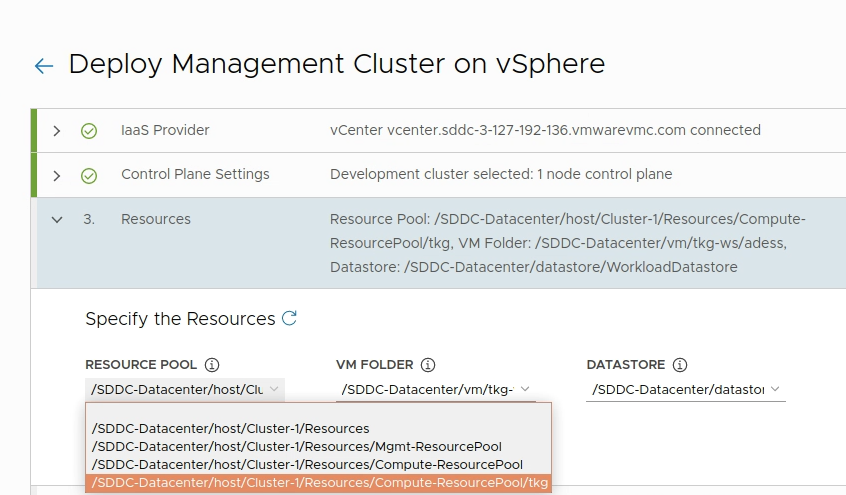
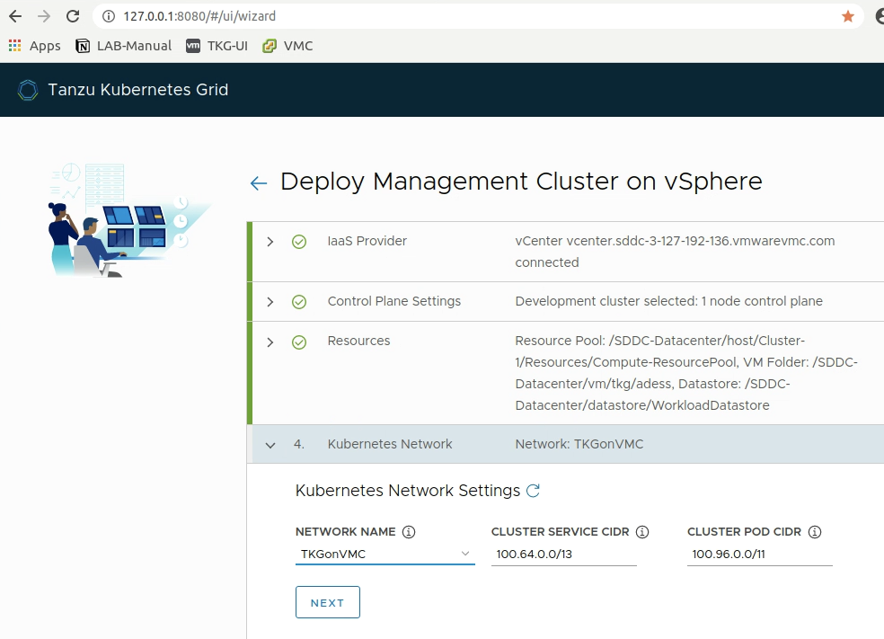
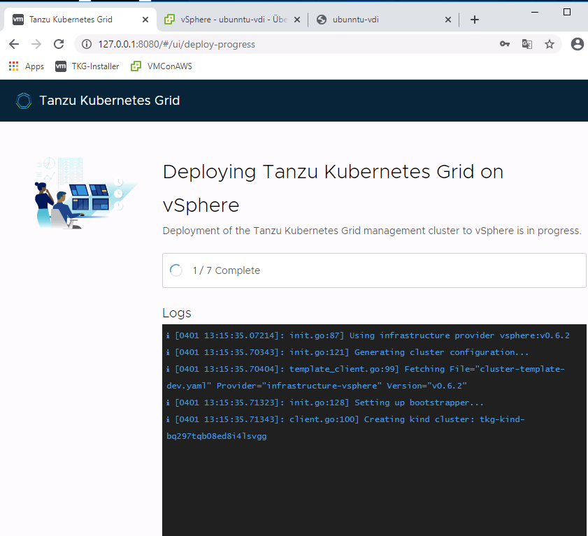
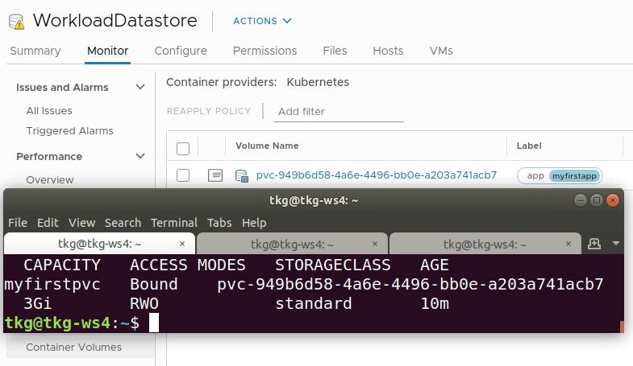

Tanzu Kubernetes Grid is GA! In this blogpost I am going to show you how easy it is to setup, configure and lifecycle enterprise K8s Clusters and applications on VMware Cloud.

We will deploy Tanzu Kubernetes Grid to VMConAWS as well as an application which uses Cloud Native vSAN Storage and existing services on VMConAWS to expose it to the outside world.

Before we start i would like to introduce you to the basic concepts of Tanzu Kubernetes Grid. Tanzu Kubernetes Grid leverages Cluster API to bring declarative Kubernetes style APIs which can be leveraged for the creation, configuration and management of Kubernetes Clusters itself. 

You can think of a K8s Cluster - our TKG Management Cluster which is provisioning TKG Workload Clusters. 

 
 
I created a video which you can follow to see the full deployment of a Tanzu Kubernetes Grid on VMware Cloud on AWS including the scaling of a TKG Cluster and the deployment of a application with persistent storage:


 
 
## Prerequisites:

**For the Jumphost:**

- Docker installed - [Documentation](https://docs.docker.com/engine/install/)
- kubectl  installed - [Documentation](https://kubernetes.io/docs/tasks/tools/install-kubectl/)
- Setup govc (optional but helpful) - [see here](https://alexdess.cloud/posts/govc/)

**For VMConAWS:**

- A DHCP enabled network for the TKG-VMs. Example in the Video is "TKGonVMC".

Firewall Rules in VMC:

- Compute Gateway:
    - Setup a FW rule to allow traffic from the network where your jumphost belongs to the "TKGonVMC" network where your nodes will be deployed - services ANY
    - Setup a FW-Rule to allow traffic from the "TKGonVMC" network where your nodes will be deployed to the SDDC-Management network - service: ANY
    - Setup a FW-Rule which allows your nodes from the "TKGonVMC" network to reach out to the Internet- service: ANY
- Management Gateway:
    - Setup a FW-Rule to allow traffic from the "TKGonVMC"  and your Jumphost network to the vCenter via HTTPS
- Create a folder and resource pool for the TKG-VMs (optional)
 
 

# The installation

### Download TKG:

TKG can be downloaded at the official VMware-Pages:

https://vmware.com/go/get-tkg

You need to download the necessary components depending on your platform. I am using a ubuntu linux desktop hosted on my VMConAWS environment. Make sure to have network connectivity between your workstation or jumphost from where you are installing your first Management Cluster to  vSphere and the TKG-Network we created earlier. I am using a ubuntu horizon desktop running in VMware Cloud on AWS to deploy TKG. Huge thanks to Robert Guske for his [great blog-post](https://rguske.github.io/post/a-linux-development-desktop-with-vmware-horizon-part-i-horizon/) how to create a linux horizon destkop and my colleague Robert Riemer for introducing me to the mysterious world of Horizon and VDI ;) ! 
 
 
### What you need to download:

The CLI for your OS (depending on your OS):

- tkg-linux-amd64-v1.0.0_vmware.1.gz

The node-Image for the worker and master nodes:

- photon-3-v1.17.3_vmware.2.ova

The API Server Load Balancer Image:

- photon-3-capv-haproxy-v0.6.3_vmware.1.ova

First we will extract the TKG CLI, make it executable and move it in our path:

    # Extract the CLI:
    gunzip tkg-linux-amd64-v1.0.0_vmware.1.gz
    
    # Rename it and move it in your Path:
    sudo mv tkg-linux-amd64-v1.0.0_vmware.1 tkg && sudo cp tkg /usr/local/bin/
    
    # verify the functionality of the CLI
    tkg version
    Client:
    	Version: v1.0.0
    	Git commit: 60f6fd5f40101d6b78e95a33334498ecca86176e
 

### Upload the required VM templates to your vCenter

The images for the K8s Nodes and the HA-Proxy need to be present in our vSphere Environment prior the deployment. You can import them via the vSphere UI or simply use [govc](https://alexdess.cloud/posts/govc/) to achieve this. If you want to get started with govc please have a look at [this previous blogpost.](https://alexdess.cloud/posts/govc/)

    # extract the available properties from the ova-image:
    govc import.spec photon-3-capv-haproxy-v0.6.3_vmware.1.ova | jq .> haproxy.json
    
    # adjust the two values in the json file to match your Network and Mark it as tempalte!
    {
    . 
          "Network": "TKGonVMC"
        }
      "MarkAsTemplate": true
    
    # Import the OVA to vCenter
    govc import.ova -options=haproxy.json photon-3-capv-haproxy-v0.6.3_vmware.1.ova
    [14-04-20 12:18:51] Uploading capv-haproxy.ova.vmdk... OK
    [14-04-20 12:18:51] Marking VM as template...
    
    # Deploy the Worker node image the same way
    govc import.spec photon-3-v1.17.3_vmware.2.ova | jq .> worker.json
    
    # Adjust the values Network and MarkAsTemplate like above
    
    # Deploy the image to vCenter:
    govc import.ova -options=worker.json photon-3-v1.17.3_vmware.2.ova
    
    govc import.ova -options=worker.json photon-3-v1.17.3_vmware.2.ova
    [14-04-20 12:23:19] Uploading photon-3-kube-v1.17.3-disk1.ova.vmdk... OK
    [14-04-20 12:23:19] Marking VM as template...
 

## Launch the TKG installer UI

We will leverage the Tanzu-Installer-UI to enter the necessary data for the deployment of the TKG Management Cluster. This is our first Cluster and will provide the possibilities to deploy our actual workload clusters. 

To start the installer UI simply leverage the following command:

    tkg init --ui

This will start a local webserver and you can begin to enter your values to the wizard.

 
### **Enter the following values on the wizard depending on your environment:**

**Section 1 - IaaS Provider:**

- your vCenter Endpoint
- Username: a User with cloudadmin privileges
- Click "Connect"
- Enter your SSH-Key: for example run "cat ~/.ssh/id_rsa.pub" in a terminal to determine your users public key or create a new one
- Select the available SDDC as Datacenter

 
**Section 2 - Control plane settings**

This are the settings for your Management Cluster which will be the control plane to deploy and manage Kubernetes Clusters. Depending on your selection the components like etcd will be deployed accordingly.

 

**Section 3 - Resources:**

- Resource Pool: Select the "tkg" resource Pool
- VM Folder: Select the folder you created earlier
- Datastore: Select the workload Datastore

 
**Section 4 Network:**

Select your "TKGonVMC" Network. It needs to have DHCP enabled! You can leave the Cluster-Service and POD-CIDR default or change it according to your preferences.

Hit next and verify if the deployment is successful. This will take approximately 7-10 minutes.

Check the status of your management cluster. The installer will automatically set the context for kubectl to the management cluster.  You can check whether your management cluster is healthy by viewing the pods running on it:

    kubectl get pods -A
    NAMESPACE                           NAME                                                             READY   STATUS    RESTARTS   AGE
    capi-kubeadm-bootstrap-system       capi-kubeadm-bootstrap-controller-manager-68d68b745-45cqd        2/2     Running   0          4h25m
    capi-kubeadm-control-plane-system   capi-kubeadm-control-plane-controller-manager-5df79cdfdd-xfcm2   2/2     Running   0          4h25m
    capi-system                         capi-controller-manager-69cd5fcdc8-7f5vr                         2/2     Running   0          4h25m
    capi-webhook-system                 capi-controller-manager-675d6bbb7c-vxgzz                         2/2     Running   0          4h25m
    capi-webhook-system                 capi-kubeadm-bootstrap-controller-manager-658dcb9d78-js9p6       2/2     Running   0          4h25m
    capi-webhook-system                 capi-kubeadm-control-plane-controller-manager-5f94cdcf78-tt86p   2/2     Running   0          4h25m
    capi-webhook-system                 capv-controller-manager-db5c995bc-m9bh2                          2/2     Running   0          4h25m
    capv-system                         capv-controller-manager-76d9454f9d-vx66f                         2/2     Running   0          4h25m
    cert-manager                        cert-manager-567cc74dfb-84m6g                                    1/1     Running   0          4h27m
    cert-manager                        cert-manager-cainjector-59f464c7ff-764c9                         1/1     Running   0          4h27m
    cert-manager                        cert-manager-webhook-549dc474bc-q2lhs                            1/1     Running   0          4h27m
    kube-system                         calico-kube-controllers-7986b8994b-hsxg4                         1/1     Running   0          4h27m
    kube-system                         calico-node-995bz                                                1/1     Running   0          4h26m
    kube-system                         calico-node-crhtv                                                1/1     Running   0          4h27m
    kube-system                         coredns-9d6cb6b59-ndlb7                                          1/1     Running   0          4h27m
    kube-system                         coredns-9d6cb6b59-s7p99                                          1/1     Running   0          4h27m
    kube-system                         etcd-tkg-management-control-plane-6nwpx                          1/1     Running   0          4h27m
    kube-system                         kube-apiserver-tkg-management-control-plane-6nwpx                1/1     Running   0          4h27m
    kube-system                         kube-controller-manager-tkg-management-control-plane-6nwpx       1/1     Running   0          4h27m
    kube-system                         kube-proxy-b4ms9                                                 1/1     Running   0          4h27m
    kube-system                         kube-proxy-v29vj                                                 1/1     Running   0          4h26m
    kube-system                         kube-scheduler-tkg-management-control-plane-6nwpx                1/1     Running   0          4h27m
    kube-system                         vsphere-cloud-controller-manager-gfd9t                           1/1     Running   0          4h27m
    kube-system                         vsphere-csi-controller-0                                         5/5     Running   0          4h27m
    kube-system                         vsphere-csi-node-lttgr                                           3/3     Running   0          4h26m
    kube-system                         vsphere-csi-node-nv74d                                           3/3     Running   0          4h26m

Looks good? - GREAT! This means it´s time to deploy our first workload Cluster :). 

The command below will create a development Cluster with 1 Master and 1 Worker node named "tkg-workload-01".

    tkg create cluster --plan=dev tkg-workload-01

Once the deployment is done the context will be switched to the workload cluster and you should be able to view all the pods running as well. 

You can use the following command to switch between existing kubeconfig contexts from now on to manage your clusters:

    kubectl config get-contexts
    CURRENT   NAME                                    CLUSTER           AUTHINFO                
    *         tkg-management-admin@tkg-management     tkg-management    tkg-management-admin
              tkg-workload-01-admin@tkg-workload-01   tkg-workload-01   tkg-workload-01-admin
    
    # to switch between cluster-contexts:
    kubectl config use-context tkg-workload-01-admin@tkg-workload-01
    Switched to context "tkg-workload-01-admin@tkg-workload-01"
 

### Persistent Storage for Kubernetes

A great feature which is provided out of the Box with TKGonVMC is, that we are able to leverage the Cloud-Native storage integration of VMConAWS to provide vSAN Storage to our K8s applications. All we need to do is to create a storage-Class in K8s which we can use and which points to the WorkloadDatastore with the correct policy. 

The Storage-Class below will create a storage class with the default vSAN-Policy pointing to the WorkloadDatastore. Make sure you replace the values according to your environment.

    cat sc.yaml
    
    kind: StorageClass
    apiVersion: storage.k8s.io/v1
    metadata:
      name: standard
      annotations:
        storageclass.kubernetes.io/is-default-class: "true"
    provisioner: csi.vsphere.vmware.com
    allowVolumeExpansion: true
    parameters:
        storagePolicyName: "vSAN Default Storage Policy"
        datastoreurl: "ds:///vmfs/volumes/vsan:b01e02424695410d-96775a9212a96fa1/"

To apply this storage class to your K8s Cluster all you have to do is to run the following command:

    kubectl apply -f sc.yaml
    storageclass.storage.k8s.io/standard created

Great - from now on we´re able to leverage the storage class "standard" in our K8s deployments. To check whether this is working you can create a simple persistent volume leveraging the following yaml-file:

    # apply the following configuration file "pvc.yaml"
    apiVersion: v1
    kind: PersistentVolumeClaim
    metadata:
      name: myfirstpvc
      namespace: default
      labels: 
            app: myfirstapp
    spec:
      storageClassName: standard
      accessModes:
        - ReadWriteOnce
      resources:
        requests:
          storage: 3Gi
    
    $ kubectl apply -f pvc.yaml
    $ persistentvolumeclaim/myfirstpvc created

    # check if the pvc is successfully bound
    $ kubectl get pvc
    NAME         STATUS   VOLUME                                     CAPACITY   ACCESS MODES   STORAGECLASS   AGE
    myfirstpvc   Bound    pvc-949b6d58-4a6e-4496-bb0e-a203a741acb7   3Gi        RWO            standard       15s

When you apply this file and it show´s bound you will also recognise that the K8s volume is now visible in the vSphere UI when you navigate to "WorkloadDatastore → Monitor →  Container Volumes".  Notice that the K8s label we set for our pvc is  directly visible in vSphere. This makes it very easy to identify the applications which are using this pvc later on.

We successfully deployed Tanzu Kubernetes grid on VMware Cloud on AWS and can now create, delete or update Kubernetes Clusters leveraging the tight integration between vSphere and Kubernetes. 

The video I made is also handling the scaling of a TKG-Cluster and the deployment of a example chat application called rocketchat. 

### Useful Links:

Download: 

- [vmware.com/go/get-tkg](http://vmware.com/go/get-tkg)

Product Documentation:

- [https://docs.vmware.com/en/VMware-Tanzu-Kubernetes-Grid/index.html](https://docs.vmware.com/en/VMware-Tanzu-Kubernetes-Grid/index.html)

Release Notes: 

- [https://docs.vmware.com/en/VMware-Tanzu-Kubernetes-Grid/1.0/rn/VMware-Tanzu-Kubernetes-Grid-10-Release-Notes.html](https://docs.vmware.com/en/VMware-Tanzu-Kubernetes-Grid/1.0/rn/VMware-Tanzu-Kubernetes-Grid-10-Release-Notes.html)

Cluster-API:

- [https://github.com/kubernetes-sigs/cluster-api](https://github.com/kubernetes-sigs/cluster-api)

Youtube-Video:

- [https://youtu.be/roHaVR-yOw8](https://youtu.be/roHaVR-yOw8)

How to create a Horizon Linux Development Desktop:

- https://rguske.github.io/post/a-linux-development-desktop-with-vmware-horizon-part-i-horizon/